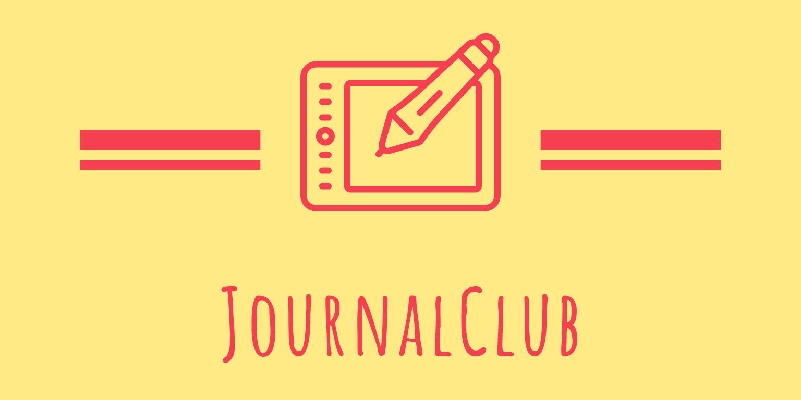

## Manual testing

## User Stories Testing

#### As a user:

- I want to signup to JournalClub so that I can contribute journal articles of my interest (**CREATE**)
    
    - **Action**: I created a new user in SignUp page.

     

    - **Expected**: User succesfully created.

     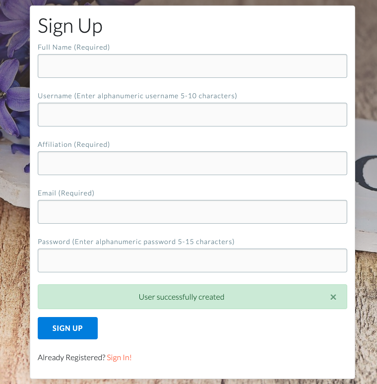

    - **Result**: Pass

     SignIn:

     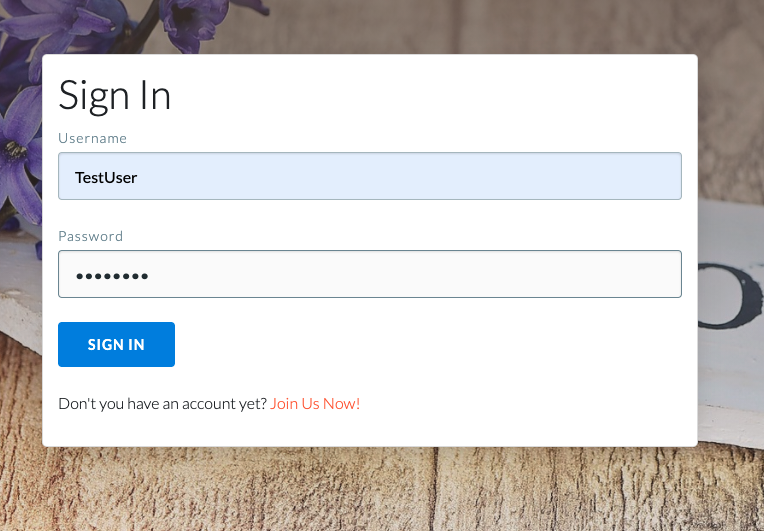

     Dashboard:

     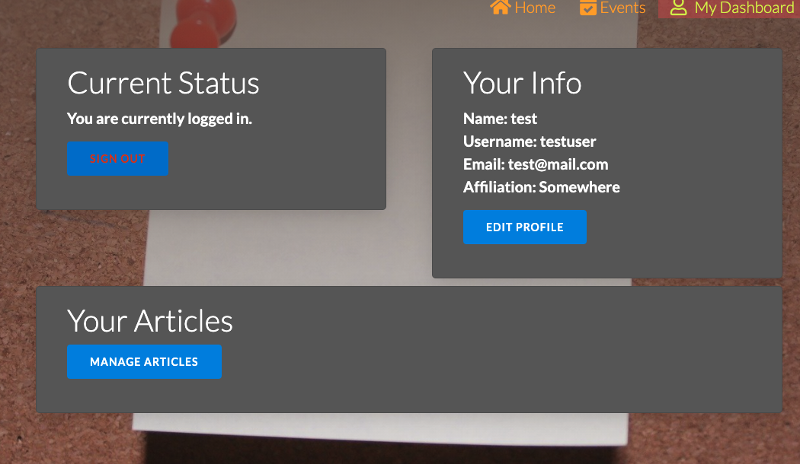

- I want to be able to modify my personal information on my profile (**UPDATE**)

    - **Action**: I clicked on **Edit Profile**.

     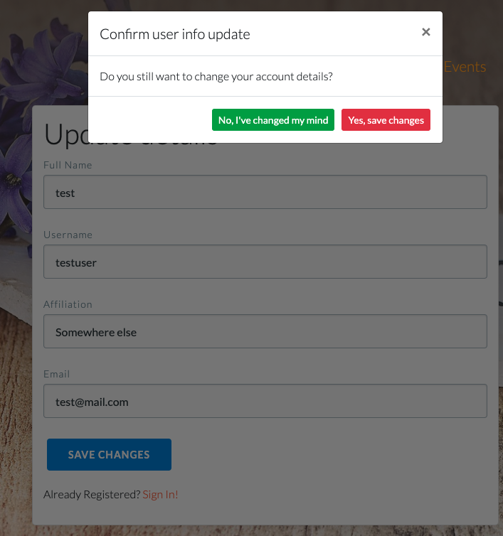

    - **Expected**: User succesfully updated.

    - **Result**: Failed

     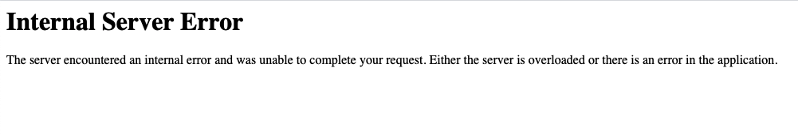

    - **Fix Action Taken**: I inspect the source code, and enable debug feature
      to find source of error. I had deleted password from session, and I had to 
      put it back.

    - **Result**: Pass

     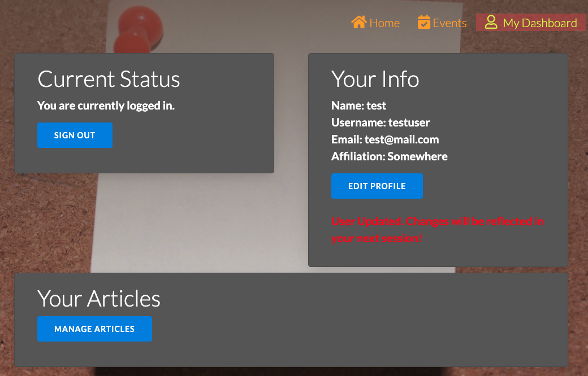
       

- I want to view all journal articles suggested by other fellow researchers.
(**INDEX**)

- **Action**: Once logged in, I clicked on **Events**.

- **Expected**: List of all available articles.

- **Result** : Pass

     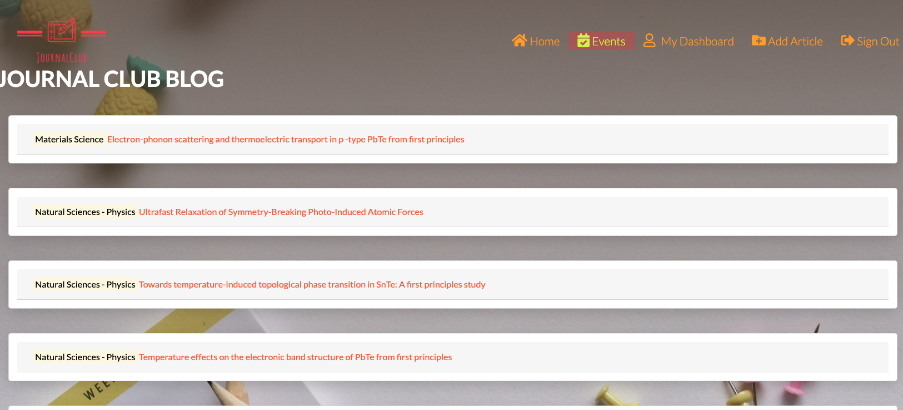

- I want to create a journal list to be shared with my fellows. (**CREATE**)

    - **Action**: Once logged in, I clicked on **Add Article** on the navegation bar.

    - **Expected**: Display form, and after completion success 
      I could go to events and see the new article added.

    - **Result** : Pass

     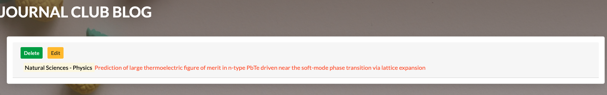 

     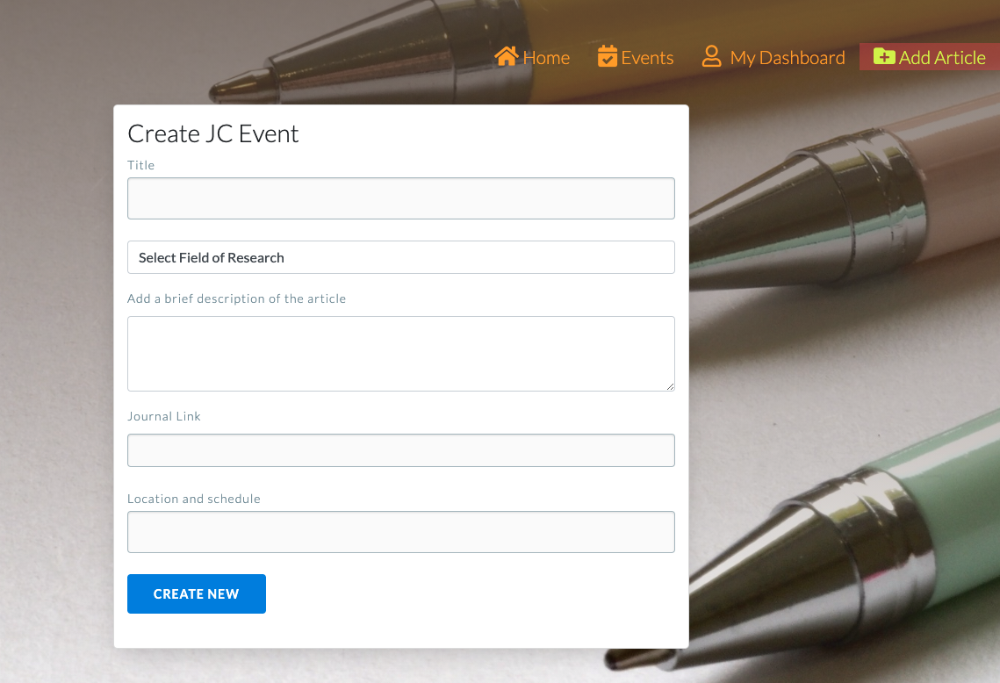 

- I want to access all details of the article journal (full citation reference).
(**READ**)

    - **Action**: Once in **Events Section**, I clicked on any of the listed articles.

    - **Expected**: Display abstract, added date, author and link to online article.

    - **Result** : Pass & Links working properly.

     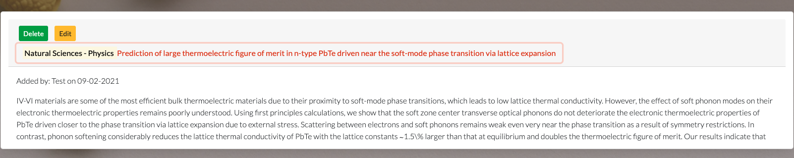 

- I want to edit a journal club event created by me. (**EDIT/UPDATE**)

    - **Action**: Once in **Events Section**, I clicked on **Edit** button on 
       the first listed article. I changed field of research.

    - **Expected**: Changes to the article displayed.

    - **Result** : Pass.

    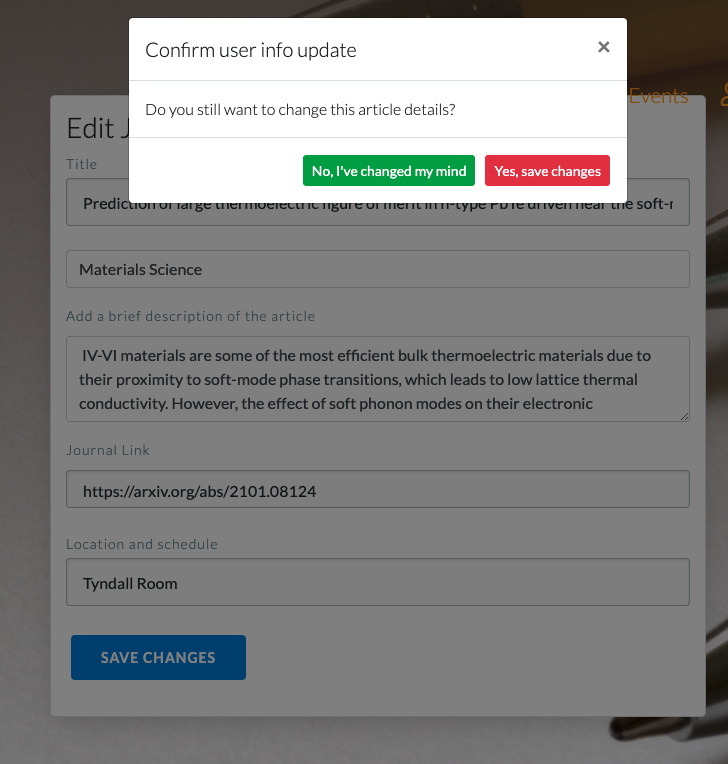 

    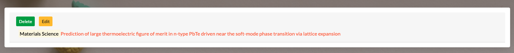 

- I want to delete a journal club event created by me. (**DESTROY**)
 
    - **Action**: Once in **Events Section**, I clicked on **Delete** button on 
       the first listed article. I changed field of research.

    - **Expected**: Article deleted from listing.

    - **Result** : Pass.

     

    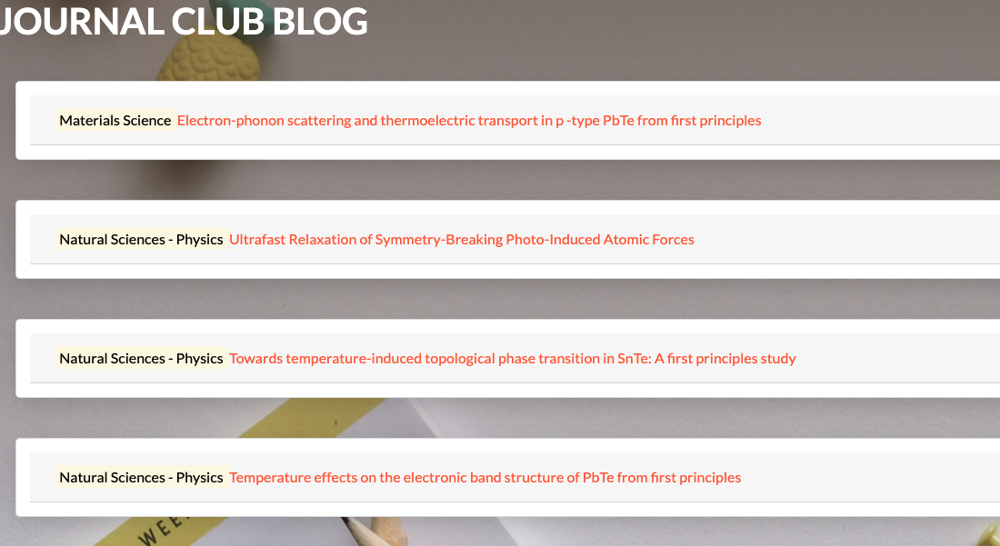 

- I want to comment on a particular journal article suggested by me or
other fellows.(**COMMENTS/CREATE**)

    - **This functionality has not been included in the current release**

- I want to delete my comments on a particular journal articule.
(**DESTROY/DELETE**)

    -  **This functionality has not been included in the current release**

## Check that changes are reflected in Database

## New User now in **users** document:

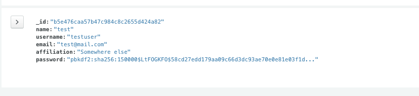 

## SignOut functionality:

- **Action**:  I clicked on **SignOut** button on navegation bar. 

- **Expected**: User redirected to **Home** page & relevant Nav Bar items removed.

- **Result** : Pass.

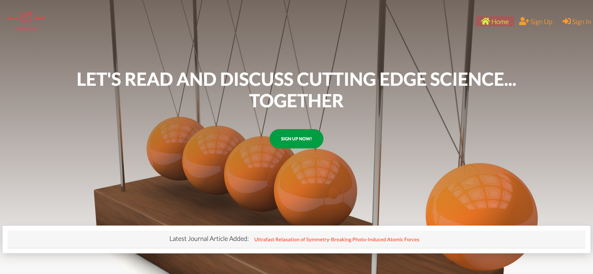 

